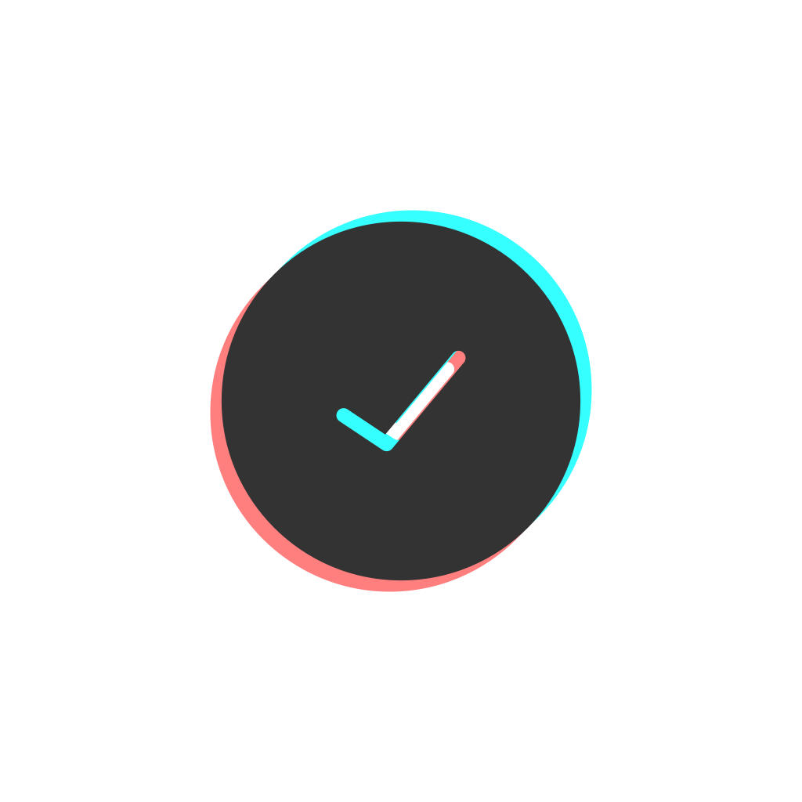

<div align="center">
  
</div>

# check-please
[](https://npmjs.org/package/check-please)
[](https://npmjs.org/package/check-please)
[](https://github.com/RichardLitt/standard-readme)
[](https://npmjs.org/package/check-please)
[](http://makeapullrequest.com)

> Simple, composable validation

## Table of Contents

- [Install](#install)
- [Usage](#usage)
- [Docs](#docs)
- [Contribute](#contribute)
- [License](#License)

## Install

This project uses [node](https://nodejs.org) and [npm](https://www.npmjs.com). 

```sh
$ npm install check-please
$ # OR
$ yarn add check-please
```

## Usage

```js
import {check, required, pattern, exact, 60ping} from './src'

const isValidFoo = check(
  exact('foo'),
  pattern(/foo/),
  required('Email is required'),
  string('Email should be string')
)

console.log(isValidFoo('foo'))

```

## Docs

## Contribute

1. Fork it and create your feature branch: git checkout -b my-new-feature
2. Commit your changes: git commit -am 'Add some feature'
3. Push to the branch: git push origin my-new-feature 
4. Submit a pull request

## License

MIT
    